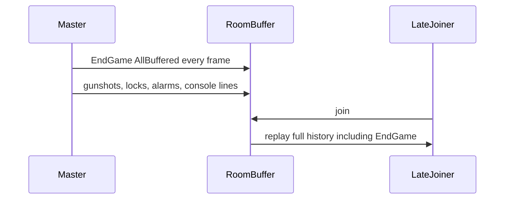

# Network and match-logic fixes

Unity 2018.2 / PUN. Do not edit anything under [Assets/Photon Unity Networking](Assets/Photon%20Unity%20Networking). Game code stays on the existing `Photon.PunBehaviour` API.

## Current failure

`[PhotonNetworkSettings.DefaultRPCNetworkTarget](Assets/PhotonNetworkSettings.cs)` is `PhotonTargets.AllBuffered`, and call sites treat it as the default for events and state. Match end in `[GameStateManager.Update](Assets/Scripts/GameStateManager.cs)` has no latch and sends a hardcoded winner of `1`. `[GameManager3D.GetTeamId](Assets/Scripts/GameManager3D.cs)` and `[GetTeleportForCurrentPlayer](Assets/Scripts/GameManager3D.cs)` decide team and spawn on the local client.

## 1. Split event RPCs from state

In `[Assets/PhotonNetworkSettings.cs](Assets/PhotonNetworkSettings.cs)`, replace the single default with two targets:

- `EventTarget` = `PhotonTargets.AllViaServer` for one-shot events (sounds, console text, destroy, flashlight toggle, end-game notification).
- `StateTarget` = `PhotonTargets.AllBufferedViaServer` only for a setter that represents current state, and only when a room property is a worse fit.

Switch these event call sites off `DefaultRPCNetworkTarget`:

- `[Assets/Scripts/GameObjects/Weapon.cs](Assets/Scripts/GameObjects/Weapon.cs)` and `[Assets/Scripts/GameObjects/HealRay3D.cs](Assets/Scripts/GameObjects/HealRay3D.cs)` fire, empty-clip, and reload sounds
- `[Assets/Scripts/Pickup3D.cs](Assets/Scripts/Pickup3D.cs)`, `[Assets/EntitySpawnConsole.cs](Assets/EntitySpawnConsole.cs)`, `[Assets/ForceBarrierManager.cs](Assets/ForceBarrierManager.cs)`
- `[Assets/Scripts/GameObjects/FlashLightController.cs](Assets/Scripts/GameObjects/FlashLightController.cs)`
- `[Assets/HudController.cs](Assets/HudController.cs)` timer updates
- `[Assets/AI/Scripts/EnemyPatrolling/EnemyPatrol.cs](Assets/AI/Scripts/EnemyPatrolling/EnemyPatrol.cs)` `SwitchTeam`
- `[Assets/PlayerReadyInfo.cs](Assets/PlayerReadyInfo.cs)` ready state: store ready on the player's custom properties and refresh the lobby from that, instead of buffering every toggle

`[GameManager3D.ConsoleMsg](Assets/Scripts/GameManager3D.cs)` becomes local `Debug.Log` plus local UI. It must not RPC by default. Spawn and connect logs currently flood the buffer.

Alarm, console lock, and pathogen library membership are state. Represent them as one current value (room or view custom properties, or a single buffered set-state RPC), not a history of raise/cancel and lock/unlock.

## 2. One match-end transition

In `[Assets/Scripts/GameStateManager.cs](Assets/Scripts/GameStateManager.cs)` and `[Assets/Scripts/GameManager3D.cs](Assets/Scripts/GameManager3D.cs)`:

- Add a `matchEnded` guard so core death and `GameEndConditions` can trip the end only once.
- Master client writes room properties `MatchPhase = Ended` and `WinningTeam` (`1` red, `2` blue) from the core that actually reached zero. `[EndGame](Assets/Scripts/GameManager3D.cs)` currently ignores its `winningTeam` argument and the core path always sends `1`.
- Send `EndGame` once with `EventTarget`. Clients only show the win panel.
- Only the master client runs `TimedReturnToLobby`. Non-masters follow via `PhotonNetwork.LoadLevel` because `automaticallySyncScene` is on.
- `EndGame` RPC returns immediately when `MatchPhase` is already `Ended`.

## 3. Master assigns team and spawn

Team: `[LobbyManager.AssignTeamId](Assets/Scripts/LobbyManager.cs)` already runs on the master. `[GameManager3D.GetTeamId](Assets/Scripts/GameManager3D.cs)` must read `PlayerTeam` with `ContainsKey` and must not recount using the local player's property bag. If the key is missing in a room, the client asks the master to assign it and waits. That removes the branch that always falls through to team `2`.

Spawn: the owning client requests a spawn. The master picks a free `TeleportController` for that team, marks it used, and replies with the index. `[PlayerManager3D.SpawnPlayer](Assets/PlayerManager3D.cs)` instantiates only after that reply. Delete the local random pick plus buffered `NetworkFlagSpawnInUse` in `GetTeleportForCurrentPlayer`.

`[PlayerManager3D.Update](Assets/PlayerManager3D.cs)` calls `SpawnPlayer` every frame while dead and the timer is expired. Gate that with a `spawnRequested` flag, cleared when the marine exists or the request fails once.

## 4. Scene sync and cleanup

- Set `PhotonNetwork.automaticallySyncScene = true` once in `[PunNetworkManager.Awake](Assets/PunNetworkManager.cs)`. Remove the later toggles in `[LobbyManager.Start](Assets/Scripts/LobbyManager.cs)` and `ShowLoadingScreen`.
- Make `PunNetworkManager.Awake` `protected virtual` and have `[PunNetworkManagerAdvanced.Awake](Assets/Scripts/PunNetworkManagerAdvanced.cs)` call `base.Awake()` so the two connection setups cannot drift.
- `[LobbyManager.Start](Assets/Scripts/LobbyManager.cs)` returns if `PhotonNetwork.room` is null, so opening the lobby scene alone does not throw.
- `ShowLoadingScreen` loads a scene name that is enabled in [ProjectSettings/EditorBuildSettings.asset](ProjectSettings/EditorBuildSettings.asset). `ShipBoardingPvp` is in `SceneToLoadEnum` but is not in the build list; add `Assets/_Scenes/Missions/ShipBoardingPvp.unity`. Map the enum to those scene names explicitly instead of relying on `ToString()` plus a second flag flip.
- `[GameManager3D.HaltGame](Assets/Scripts/GameManager3D.cs)` destroys only `PhotonView`s owned by this client. It must not `PhotonNetwork.Destroy` every DontDestroyOnLoad root.

`[MasterClientEvents](Assets/MasterClientEvents.cs)` reapplies its master-only objects in `OnMasterClientSwitched`, not only `Start`.

## 5. Owner-only death and mutation side effects

- `[HealthComponent.TriggerDeathEventCallBacks](Assets/Scripts/Components/HealthComponent.cs)` instantiates the ragdoll and destroys the object only when `photonView.isMine` (or offline). Other clients observe the network instantiate and the network destroy.
- `[MutationController.AddPathogen](Assets/MutationController.cs)` (the RPC) applies only on the owning client, or on the master for scene objects with no owner. Same rule for cure RPCs in that file.
- `[AccessConsole3D.Update](Assets/AccessConsole3D.cs)` sends `UnlockConsole` once when the lock timer elapses, using a fired flag so a locked console does not emit an RPC every frame.

## Out of scope

No upgrade to PUN 2, no ECS rewrite, and no change to mini-game puzzle rules beyond the RPC and authority fixes their controllers already share.